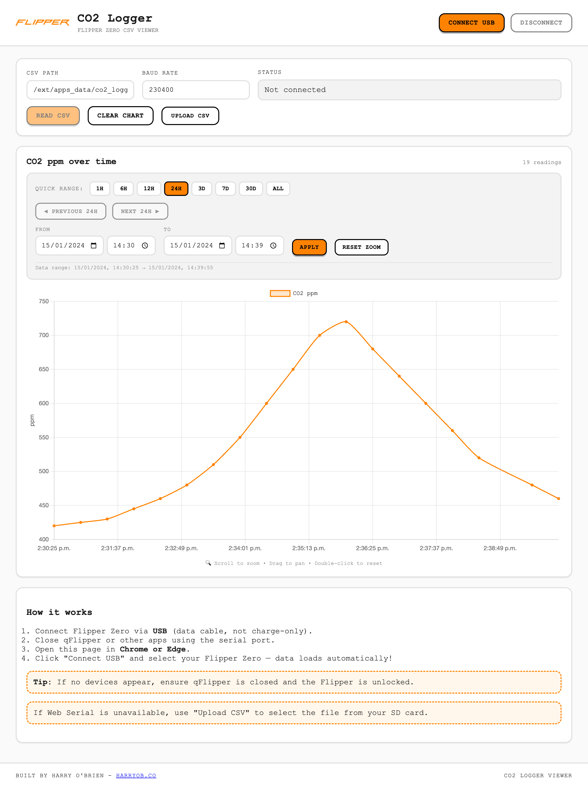
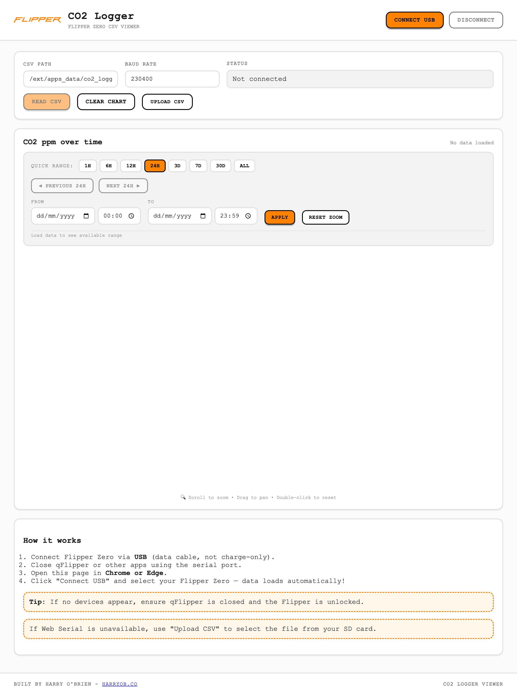

<div align="center">

# 🌬️ CO2 Logger Viewer

### Visualize your Flipper Zero CO2 data — instantly, in your browser

[](https://flipperzero.one)
[](https://developer.chrome.com/docs/capabilities/serial)
[](/)
[](LICENSE)

<br />

**Plug in your Flipper. Click connect. See your CO2 data.**

No drivers. No apps. No setup. Just plug and visualize.

[🚀 **Try Live Demo**](https://www.flipperco2.com/) · [📖 Documentation](#how-it-works) · [🐬 CO2 Logger App](https://github.com/harryob2/co2_logger)

<br />



</div>

---

## ✨ Why CO2 Logger Viewer?

| Problem | Solution |
|---------|----------|
| 📂 Manually copying CSV files from your Flipper | 🔌 **Direct USB connection** — reads data straight from your device |
| 🖥️ Opening spreadsheets to visualize data | 📊 **Instant charts** — beautiful visualization in seconds |
| ⚙️ Installing drivers and desktop apps | 🌐 **Browser-based** — works in Chrome/Edge, no installation |
| 📱 Mobile unfriendly workflows | 📤 **CSV upload fallback** — works on any device |

---

## 📸 Screenshots

<table>
  <tr>
    <td align="center">
      
      <br />
      <em>Clean, minimal interface</em>
    </td>
    <td align="center">
      
      <br />
      <em>Interactive CO2 chart with zoom & pan</em>
    </td>
  </tr>
</table>

---

## 🚀 Quick Start

### Option 1: Direct USB Connection (Recommended)

```
1. Connect your Flipper Zero via USB
2. Close qFlipper (it locks the serial port)
3. Open the app in Chrome or Edge
4. Click "Connect USB" → Select your Flipper
5. Done! Your CO2 data loads automatically
```

### Option 2: Manual CSV Upload

Works on any browser — just click **Upload CSV** and select the file from your Flipper's SD card.

---

## 🔗 Live Demo

**[👉 Try it now at flipperco2.com](https://www.flipperco2.com/)**

No installation needed — just open in Chrome or Edge and connect your Flipper!

---

## 🛠️ How It Works

```
┌─────────────────┐    Web Serial API    ┌──────────────────┐
│  Flipper Zero   │ ◄─────────────────► │  Browser App     │
│  CO2 Logger     │      USB Serial      │  Chart.js        │
│  (CSV on SD)    │                      │  Visualization   │
└─────────────────┘                      └──────────────────┘
```

1. **Connects** to your Flipper Zero over USB using the [Web Serial API](https://developer.chrome.com/docs/capabilities/serial)
2. **Reads** `/ext/apps_data/co2_logger/co2_log.csv` via the Flipper CLI
3. **Parses** the CSV data and renders an interactive time-series chart
4. **Lets you explore** with zoom, pan, and time range selection

---

## 💻 Browser Support

| Browser | USB Connection | CSV Upload |
|---------|:--------------:|:----------:|
| Chrome  | ✅ | ✅ |
| Edge    | ✅ | ✅ |
| Firefox | ❌ | ✅ |
| Safari  | ❌ | ✅ |

> **Note:** Web Serial API is required for direct USB connection. Unsupported browsers can still use the CSV upload feature.

---

## ⚙️ Configuration

| Setting | Default | Description |
|---------|---------|-------------|
| CSV Path | `/ext/apps_data/co2_logger/co2_log.csv` | Path on Flipper's SD card |
| Baud Rate | `230400` | Serial communication speed |

---

## 🤝 Related Projects

- **[CO2 Logger (Flipper App)](https://github.com/harryob2/co2_logger)** — The companion Flipper Zero app that logs CO2 data

---

## 📜 License

MIT © [Harry O'Brien](https://harryob.co)

---

<div align="center">

**[⬆ Back to top](#-co2-logger-viewer)**

Made with 🧡 for the Flipper Zero community

</div>
